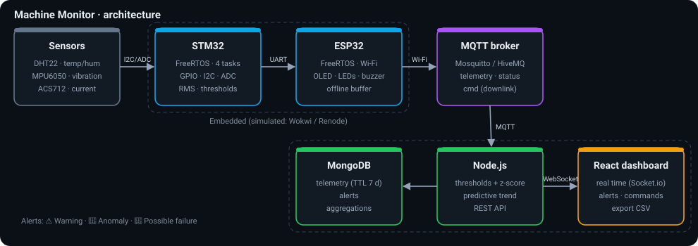

# ⚙️ Machine Monitor : surveillance industrielle et détection d'anomalies

Système IoT de **maintenance prédictive** : des capteurs surveillent une machine (température, vibration, courant),
un microcontrôleur sous **FreeRTOS** détecte les dérives, un **réseau de neurones embarqué (TinyML)** repère les
comportements anormaux et un **dashboard web temps réel** affiche l'état et les alertes.

> ✅ Projet **entièrement validé en simulation** (Wokwi, Renode, simulateur MQTT), conçu pour un portage direct sur matériel réel.



```
Capteurs (DHT22, MPU6050, ACS712)
   ↓  GPIO / I2C / ADC
STM32 + FreeRTOS  ── trame UART "$MM,...*CS" ──►  ESP32 + FreeRTOS
                                                   ↓ Wi-Fi / MQTT
                                                 Broker (Mosquitto / HiveMQ)
                                                   ↓
                                                 Node.js : analyse (seuils, z-score, tendance)
                                                   ↓                    ↓ Socket.io
                                                 MongoDB             React Dashboard
```

## Fonctionnalités

| Détection | Méthode | Alerte |
|---|---|---|
| Température trop élevée | Seuils 60 / 75 °C avec hystérésis | ⚠️ Warning → 🚨 Surchauffe |
| Vibration anormale | RMS sur fenêtre 1 s (100 Hz) + **z-score** | 🚨 Anomaly |
| Courant anormal | Moyenne ADC, seuils 3,5 / 4,5 A | 🚨 Possible failure |
| Surchauffe à venir | **Régression linéaire** sur la température | 🔮 « Surchauffe dans ~N min » |
| Machine déconnectée | **Last Will MQTT** + watchdog serveur | 📡 Hors ligne |
| Combinaison anormale (ex. 45 °C sans charge) | **Réseau de neurones embarqué dans l'ESP32** (TinyML) | 🤖 Anomalie IA + cause probable |
| Alerte sur téléphone | Bot **Telegram** (critiques, prédictives et IA, anti-spam 60 s) | 📱 Notification |

Deux nœuds d'acquisition : **ESP32** (DHT22, MPU6050, ACS712, OLED) et **STM32 Nucleo-C031C6 sous FreeRTOS**
(NTC, HIH-4030, MPU6050, ACS712) relié à un **ESP32 passerelle** par UART. Historique dans **MongoDB** (7 jours).

Et aussi : LEDs, buzzer et écran OLED locaux (l'alarme marche **sans réseau**), bouton et commande MQTT
« injecter une panne » pour la démo, tampon des mesures pendant les coupures Wi-Fi, acquittement
des alertes, export CSV, plusieurs machines, Docker Compose, CI GitHub Actions.

## Structure

```
firmware/
├── esp32-wokwi/      ESP32 autonome : 6 tâches FreeRTOS, capteurs, OLED, MQTT  ← à lancer sur Wokwi
├── esp32-bridge/     ESP32 passerelle UART → MQTT (architecture complète avec STM32)
├── esp32-bridge-vscode/ la même passerelle, en projet PlatformIO simulable sur Wokwi
├── esp32-vscode/     Projet PlatformIO de l'ESP32 pour Wokwi dans VS Code
├── stm32-nucleo/      STM32 Nucleo-C031C6 + FreeRTOS (PlatformIO) simulable sur Wokwi
ai/                   IA embarquée : entraînement du réseau (NumPy) → code C pour l'ESP32
└── stm32/            STM32 FreeRTOS (CMSIS-RTOS v2), pilotes capteurs, protocole UART, Renode
gateway/              Passerelle Python UART/Renode → MQTT (remplace l'ESP32 en simulation)
simulator/            Simulateur de machines (scénarios de pannes réalistes)
backend/              Node.js : MQTT → analyse → MongoDB → Socket.io + API REST
frontend/             Dashboard React (Vite + Recharts)
docker-compose.yml    Mosquitto + MongoDB + backend + dashboard (+ simulateur)
```

---

## 🚀 Démarrage rapide

### Option 1 : Tout en local avec Docker (le plus simple)

```bash
docker compose --profile sim up --build
```
Ouvre **http://localhost:5173**. Deux machines simulées enchaînent automatiquement :
normal → surchauffe → usure de roulement → surintensité.

### Option 2 : Sans Docker

Prérequis : Node.js 20+. MongoDB est facultatif (sans lui, stockage en mémoire).

```bash
# Terminal 1 — backend
cd backend && cp .env.example .env && npm install && npm start

# Terminal 2 — dashboard
cd frontend && npm install && npm run dev          # http://localhost:5173

# Terminal 3 — simulateur (touches : n/o/b/c pour changer de scénario)
cd simulator && npm install && npm start
```
Par défaut tout passe par le broker public `broker.hivemq.com` : aucun Mosquitto à installer.

### Option 3 : ESP32 simulé sur Wokwi (le plus impressionnant)

1. Va sur **https://wokwi.com/projects/new/esp32**.
2. Remplace `sketch.ino` et `diagram.json` par ceux de `firmware/esp32-wokwi/`.
3. Onglet **Library Manager** → ajoute les bibliothèques de `libraries.txt` (ou crée un fichier `libraries.txt` avec ce contenu).
4. Lance la simulation ▶. Le moniteur série affiche `[MQTT] connecté`.
5. Lance le **backend** et le **dashboard** (option 2, sans le simulateur) : les données Wokwi arrivent en direct.

**Provoquer des anomalies dans Wokwi :**
- Clique sur le **DHT22** → monte la température au-delà de 60 °C puis 75 °C.
- La vibration est calculée sur la **variation** du signal (RMS, moyenne retirée) : une valeur fixe du MPU6050 donne donc 0 g. Pour simuler une vibration, utilise le bouton « Panne » (balourd à 25 Hz).
- Tourne le **potentiomètre** (il simule le capteur de courant ACS712) vers une extrémité → surintensité.
- Appuie sur le **bouton rouge** « Panne » → panne complète simulée (balourd 25 Hz, surchauffe, surintensité).
- Ou clique sur **« Injecter une panne »** dans le dashboard : la commande descend par MQTT jusqu'à l'ESP32.

> ⚠️ Le broker est public : change `TOPIC_PREFIX` (même valeur dans `sketch.ino`, `backend/.env` et le simulateur) pour ne pas recevoir les données d'un autre utilisateur.

### Option 4 : STM32 Nucleo-C031C6 + FreeRTOS simulé sur Wokwi (VS Code)

Ouvre `firmware/stm32-nucleo/` dans VS Code → PlatformIO **Build** → **F1 › Wokwi: Start Simulator**,
puis dans `backend/` : `npm run stm32`. Wokwi expose l'UART du STM32 sur `localhost:4100`
(RFC2217) ; la passerelle décode les trames et les publie en MQTT (machine **stm32-01**).
Les commandes « Injecter une panne » du dashboard redescendent jusqu'au STM32.

> 💡 Wokwi met la simulation en pause quand son onglet n'est pas visible : garde la fenêtre de simulation affichée (par exemple côte à côte avec le dashboard), sinon aucune trame n'arrive.

### Option 4 bis : architecture complète STM32 → UART → ESP32 → Wi-Fi (deux simulations)

1. Simulation STM32 : `firmware/stm32-nucleo/` (port série exposé sur 4100).
2. Simulation ESP32 passerelle : `firmware/esp32-bridge-vscode/` (port série exposé sur 4200).
3. Câble UART virtuel entre les deux : `cd backend && npm run cable`.

Le STM32 mesure, l'ESP32 reçoit les trames par UART et les publie en MQTT par Wi-Fi ;
les commandes du dashboard redescendent ESP32 → STM32. Garde les deux simulations visibles.

### Option 5 : STM32CubeIDE (HAL) + Renode

Voir [`firmware/stm32/README.md`](firmware/stm32/README.md) : création du projet CubeIDE, exécution du `.elf`
sous Renode, puis `python gateway/uart_gateway.py --tcp localhost:3456`.

---

## 🤖 IA embarquée (TinyML)

Un réseau de neurones de 369 poids (≈ 1,5 Ko) tourne **dans l'ESP32** et juge chaque mesure.
Il détecte ce que les seuils ne voient pas : 45 °C alors que le moteur ne consomme rien
(refroidissement en panne), température ambiante malgré 3 A (capteur défaillant), chocs de
vibration (roulement). Détails, méthode et résultats : [`ai/README.md`](ai/README.md).

**Démo dans Wokwi :** monte la température (NTC du STM32 ou DHT22 de l'ESP32) à **45 °C** :
les seuils restent « Normal », mais l'IA signale une anomalie (cause : température) dans le
dashboard et sur Telegram.

## 🧪 Tests

```bash
cd backend && npm test                                  # anomalies, IA, trames, Telegram (17 tests)
python ai/train_model.py && gcc -I ai ai/test_tinyml.c -lm -o t && ./t   # IA : C == Python
cd firmware/stm32/test && gcc -Wall -Wextra -I../Core/Inc test_protocol.c ../Core/Src/protocol.c -o t && ./t
python gateway/uart_gateway.py --stdin --dry-run < gateway/trames_exemple.txt
```
La CI GitHub Actions (`.github/workflows/ci.yml`) compile les deux firmwares ESP32, lance les tests et construit le dashboard.

## 📡 Format des données

**MQTT** `<prefix>/<deviceId>/telemetry` (1 Hz) :
```json
{ "deviceId": "machine01", "seq": 128, "temperature": 42.3, "humidity": 45.1,
  "vibRms": 0.052, "vibPeak": 0.089, "current": 1.62, "state": "NORMAL",
  "levels": { "temperature": "NORMAL", "vibration": "NORMAL", "current": "NORMAL" },
  "faultInjected": false, "health": { "dht": true, "mpu": true },
  "ai": { "score": 0.002, "anomaly": false, "cause": "" } }
```
Aussi : `<prefix>/<id>/status` (`online` / `offline`, retenu + Last Will) et `<prefix>/<id>/cmd`
(`fault_on`, `fault_off`, `mute`, `unmute`).

**UART STM32 → ESP32** : `$MM,<seq>,<temp×10>,<hum×10>,<vib mg>,<crête mg>,<courant mA>,<flags>*<XOR>\r\n`

**API REST** : `GET /api/health`, `/api/devices`, `/api/telemetry?deviceId=&minutes=`, `/api/alerts`,
`/api/stats/:id`, `/api/export.csv`, `POST /api/alerts/:id/ack`, `POST /api/devices/:id/cmd`.

## 🔒 Sécurité

| Mode | Broker | Chiffrement | Authentification |
|---|---|---|---|
| Démo (par défaut) | `broker.hivemq.com` public | ❌ | ❌ |
| **Production** | **EMQX Cloud Serverless** (ou HiveMQ Cloud) privé | ✅ TLS 1.2, port 8883, certificat racine vérifié par l'ESP32 | ✅ identifiant / mot de passe |

- Firmwares ESP32 : copier `include/secrets.example.h` en `include/secrets.h` (exclu de Git) et le remplir.
- Backend : `MQTT_URL=mqtts://<adresse-du-broker>:8883`, `MQTT_USERNAME`, `MQTT_PASSWORD` dans `.env`.
- Les secrets (`.env`, `secrets.h`, token Telegram) ne sont jamais versionnés.

## 🗺️ Évolutions possibles

- FFT sur la vibration (ESP-DSP / CMSIS-DSP) pour identifier la fréquence du défaut
- Entraînement de l'IA sur des données réelles de la machine (au lieu du modèle physique)
- Droits d'accès par appareil (ACL), OTA pour le firmware ESP32

## Licence

MIT
